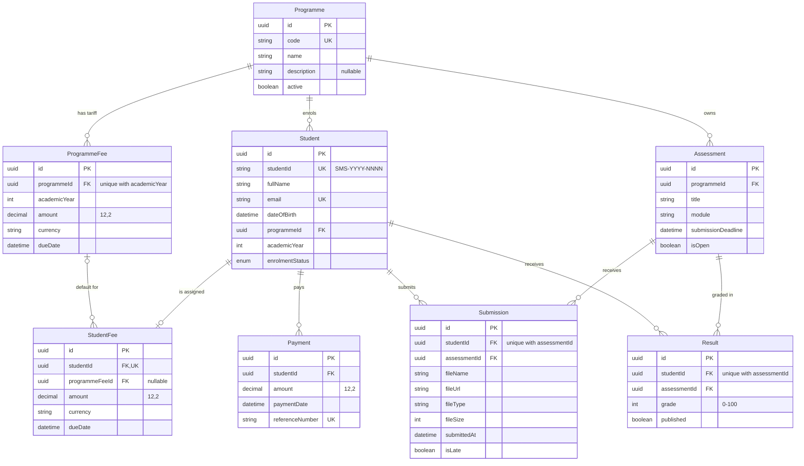

# Student Management System — Registry Module
## Architecture & Database Design

> **Purpose:** Architecture specification for the PEN Global technical assessment.
>
> **Required stack:** Next.js 16+ (App Router), PostgreSQL, Prisma ORM, Tailwind CSS or a component library (Shadcn UI preferred).
>
> **Assessment constraint:** This is a focused Registry module, not a full Student Management System. Prioritize deliberate product decisions, edge cases, clean schema/API design, and a working end-to-end MVP.

---

## 1. Assessment Scope

The application covers four daily Registry workflows:

1. Student Enrolment
2. Fees & Payments
3. Assessment Submission
4. Marksheet & Results

The assessment requires:

- Next.js 16+ with App Router
- PostgreSQL
- Prisma ORM
- Real database data
- No separate backend framework
- GitHub repository
- README with local setup, environment variables, and AI usage
- Seed script with at least 5 students, 2 programmes, fees, and sample grades
- Staff view and Student view
- Authentication is optional; a simple role toggle is acceptable

## 1.1 Requirement Traceability

The source of truth is the PEN Global assessment brief (PDF). It is marked for recruitment use only, so it is **not committed**; the requirements are paraphrased here. Every requirement maps to a section of this document.

| ID | Requirement (paraphrased from the brief) | Addressed in |
|---|---|---|
| E1 | Create student records: full name, email, date of birth, programme, academic year, enrolment status | §4.2, §20 |
| E2 | Auto-generate a unique Student ID (e.g. `SMS-2025-0001`) | §4.2 |
| E3 | Enrolment statuses: Enrolled, Deferred, Withdrawn, Completed | §5 |
| E4 | Search and filter students by name, ID, programme, or status | §20 |
| F1 | Assign a fee amount to each student based on their programme | §6, §6A, §21 |
| F2 | Record payment transactions: amount, date, reference number | §7, §21 |
| F3 | Show outstanding balance in real time | §7 |
| F4 | Flag students with an overdue balance on the Registry dashboard | §19 |
| A1 | Staff create an assessment: title, module, submission deadline | §8, §22 |
| A2 | Students upload a PDF or DOCX against an **open** assessment | §8, §9 |
| A3 | One submission per student per assessment; allow resubmission **before the deadline** | §9 |
| A4 | Late submissions are accepted but visually flagged | §10 |
| R1 | Staff enter a numeric grade (0–100) per student per assessment | §11, §23 |
| R2 | Classification: Pass ≥ 40, Merit ≥ 60, Distinction ≥ 70 | §12 |
| R3 | Staff publish or withhold results **per student** | §13, §23 |
| R4 | Students see their marksheet only after it has been published | §13, §24 |
| S1 | GitHub repository; README with local setup, `.env` variables, and AI usage | §37, §38 |
| S2 | Seed script: at least 5 students, 2 programmes, fees, and sample grades | §28 |
| S3 | Staff view and Student view; a simple role toggle is acceptable | §27 |
| T1 | Clean schema, **working API routes**, basic error handling | §16, §17.1, §29, §31 |
| C1 | Next.js 16+ App Router; PostgreSQL + Prisma with committed schema; Tailwind / shadcn; no other backend framework; no mocked `useState` data; `.env` example, no committed credentials | §2, §33 |

### How the brief is graded

| Dimension | Weight | What it means for this build |
|---|---|---|
| Stakeholder understanding | 30% | Data model and UI match how a Registry team works (§6A, §8, §13) |
| Feature intuition | 30% | Edge cases handled without being told: overdue fees, late submissions, withheld results (§25) |
| Technical quality | 25% | Clean schema, working API routes, basic error handling (§16, §17.1, §31) |
| AI usage | 15% | README explains how AI was used during the build (§38) |

## 1.2 Requirements Review — 2026-09-16

A line-by-line re-check of the brief against the first draft of this document found these gaps. Each is resolved in the sections listed.

| # | Gap in the first draft | What the brief says | Resolution |
|---|---|---|---|
| 1 | The fee was derived live from the programme tariff. Staff had no in-app way to assign a fee, and editing a tariff would rewrite the balance of students who had already paid. | Assign a fee amount to each student based on their programme (F1) | New `StudentFee` entity: copied from the programme tariff at enrolment, adjustable by staff (§6A) |
| 2 | Assessments were not linked to a programme, so every student would see, and be counted as pending for, every assessment. | Students submit against assessments created by staff (A1–A2) | `Assessment.programmeId` (§8, §19) |
| 3 | No concept of an open assessment, so late submissions could be accepted forever. | Upload against an **open** assessment (A2) | `Assessment.isOpen`, controlled by staff (§8, §9) |
| 4 | The build prompt allowed resubmission at any time. | Allow resubmission **before the deadline** (A3) | Replacing a submission after the deadline is rejected; a first late submission is still accepted (§9, §10) |
| 5 | Publishing was designed per result and per assessment only. | Publish or withhold results **per student** (R3) | Per-student marksheet publish / withhold (§13, §23) |
| 6 | The build prompt removed every API route except file download. | Working API routes are graded (T1) | Small JSON API of Route Handlers over the shared service layer (§17.1, §29) |
| 7 | Deferred, withdrawn and completed students could submit and were counted as pending. | Stakeholder understanding (30%) | Only `ENROLLED` students of the assessment's programme can submit or count as pending (§9, §19) |

---

# 2. Architecture

## 2.1 High-Level Architecture

```text
┌─────────────────────────────────────────────────────────┐
│                    Next.js Application                  │
│                    App Router                           │
├─────────────────────────────────────────────────────────┤
│                                                         │
│  Staff UI                         Student UI             │
│  ├── Dashboard                   ├── Dashboard           │
│  ├── Students                    ├── Fees                │
│  ├── Fees & Payments             ├── Assessments         │
│  ├── Assessments                 └── Marksheet            │
│  └── Results                                             │
│                                                         │
├─────────────────────────────────────────────────────────┤
│              Application / Domain Logic                 │
│                                                         │
│  Student Service                                      │
│  Fee Service                                          │
│  Assessment Service                                   │
│  Submission Service                                   │
│  Result Service                                       │
│                                                         │
├─────────────────────────────────────────────────────────┤
│                 Next.js Server Layer                     │
│                                                         │
│  Server Actions / Route Handlers                       │
│                                                         │
├─────────────────────────────────────────────────────────┤
│                    Prisma ORM                            │
├─────────────────────────────────────────────────────────┤
│                  PostgreSQL                              │
└─────────────────────────────────────────────────────────┘
```

## 2.2 Architectural Principles

- Use Next.js App Router.
- Keep server-side business rules on the server.
- Use Prisma as the database access layer.
- PostgreSQL is the source of truth.
- Do not mock application data in `useState`.
- Use Server Actions for suitable mutations.
- Use Route Handlers when an HTTP endpoint is genuinely useful.
- Keep domain/business logic separate from presentation where practical.
- Do not introduce another backend framework.
- Avoid unnecessary infrastructure and overengineering.

---

# 3. Domain Model

## 3.1 Core Entities

The domain consists of eight core entities:

```text
Programme
    │
    ├──────────< ProgrammeFee          (fee tariff per academic year)
    │                  ┆
    │                  ┆ copied at enrolment
    │                  ▼
    ├──────────< Student ────────── StudentFee   (0..1, the fee actually assigned)
    │               │
    │               ├──────< Payment
    │               ├──────< Submission >──────┐
    │               └──────< Result >──────────┤
    │                                          │
    └──────────< Assessment ───────────────────┘
```

Entities:

1. `Programme`
2. `ProgrammeFee`
3. `StudentFee`
4. `Student`
5. `Payment`
6. `Assessment`
7. `Submission`
8. `Result`

---

# 4. Database Schema

## 4.1 Programme

Represents an academic programme.

```text
Programme
---------
id
code
name
description
active
createdAt
updatedAt
```

### Rules

- `id`: internal UUID.
- `code`: required and unique.
- `name`: required.
- `active`: boolean.
- A programme can have many students.
- A programme can have many programme fee definitions.

Example:

```text
BSC-CS | BSc Computer Science
MBA    | Master of Business Administration
```

---

## 4.2 Student

The central academic entity.

```text
Student
-------
id
studentId
fullName
email
dateOfBirth
programmeId
academicYear
enrolmentStatus
createdAt
updatedAt
```

### Rules

- `id`: internal UUID.
- `studentId`: required and unique business identifier.
- `fullName`: required.
- `email`: required.
- `dateOfBirth`: required.
- `programmeId`: required.
- `academicYear`: required.
- `enrolmentStatus`: enum.
- A student belongs to one programme.
- A student has zero or one assigned fee (`StudentFee`, §6A).
- A student can have many payments.
- A student can have many submissions.
- A student can have many results.

### Student ID

Automatically generate IDs in the format:

```text
SMS-2025-0001
SMS-2025-0002
SMS-2025-0003
```

Do not use the internal database ID as the business-facing Student ID.

The year in the Student ID is the student's academic year at creation. The Student ID never changes afterwards, even if the academic year or programme is edited.

```text
id        → internal identifier
studentId → business identifier
```

---

# 5. Enrolment Status

Use a Prisma enum rather than arbitrary strings.

```text
ENROLLED
DEFERRED
WITHDRAWN
COMPLETED
```

These correspond to the required assessment statuses.

---

# 6. ProgrammeFee (Fee Tariff)

Represents the standard fee for a programme in an academic year. It is the **default** used when a fee is assigned to a student (§6A). It is not the student's fee itself: changing a tariff never changes fees already assigned.

```text
ProgrammeFee
------------
id
programmeId
academicYear
amount
currency
dueDate
createdAt
updatedAt
```

### Rules

- `programmeId`: required foreign key.
- `academicYear`: required.
- `amount`: positive monetary amount.
- `currency`: required; use `BDT` for demo data unless another requirement is introduced.
- `dueDate`: default payment deadline, copied into each assigned `StudentFee`.
- A programme can have different fees for different academic years.

Example:

```text
Programme: BSc Computer Science
Academic Year: 2025
Amount: 150000
Currency: BDT
Due Date: 2025-10-31
```

### Product Decision — Overdue Balance

The assessment requires overdue balances but does not specify a detailed payment schedule.

For this MVP:

```text
overdue = today > studentFee.dueDate AND outstandingBalance > 0
```

Document this as an explicit product decision in the README.

---

# 6A. StudentFee

Represents the fee actually assigned to one student.

```text
StudentFee
----------
id
studentId
programmeFeeId
amount
currency
dueDate
createdAt
updatedAt
```

### Rules

- `studentId`: required and unique — one assigned fee per student.
- `programmeFeeId`: optional. The tariff the fee was copied from; `null` when staff set the fee manually.
- `amount`: greater than zero, and never below the total the student has already paid.
- `currency` and `dueDate`: required.
- **On student creation**, if a `ProgrammeFee` exists for `(programmeId, academicYear)`, a `StudentFee` is created in the same transaction by copying `amount`, `currency` and `dueDate`.
- If no tariff exists, the student has **no assigned fee**. The UI shows "No fee assigned" (not "0 BDT outstanding"), payments are blocked, and staff can assign a fee manually.
- Staff can **adjust** the amount or due date, for example for a scholarship or an agreed extension.
- Editing a student's programme or academic year does **not** silently change their fee. The staff UI shows that the assigned fee no longer matches the programme tariff and offers an explicit "Reassign from tariff" action.

### Product Decision — Assigned (snapshot) fee, not derived fee

The brief says to *assign a fee amount to each student based on their programme*.

A fee derived live from `ProgrammeFee` has two problems a Registry would reject:

1. Editing a tariff rewrites the balance of every existing student, including students who have already paid in full.
2. There is nowhere to record a student-specific amount (scholarship, discount, agreed arrangement).

So the programme tariff supplies the default, and the student's fee is copied into `StudentFee` at enrolment. The outstanding balance is still calculated, never stored (§7).

---

# 7. Payment

Represents an individual payment transaction.

```text
Payment
-------
id
studentId
amount
paymentDate
referenceNumber
createdAt
updatedAt
```

### Rules

- A payment belongs to exactly one student.
- `amount` must be greater than zero.
- `referenceNumber` should be unique.
- Payment cannot exceed the student's current outstanding balance.
- Payment date is required and cannot be in the future.
- A payment is rejected when the student has no assigned fee.

### Outstanding Balance

Do not store `outstandingBalance` as a manually editable field.

Calculate:

```text
Outstanding Balance =
StudentFee.amount - SUM(Payments)
```

This avoids data inconsistency.

Example:

```text
Assigned Fee:       150,000 BDT
Payment #1:          50,000 BDT
Payment #2:          40,000 BDT
--------------------------------
Paid:                90,000 BDT
Outstanding:         60,000 BDT
```

---

# 8. Assessment

Represents an assessment created by staff for one programme.

```text
Assessment
----------
id
programmeId
title
module
submissionDeadline
isOpen
createdAt
updatedAt
```

### Rules

- `programmeId`: required. Only students of this programme see the assessment, submit to it, or receive a result for it.
- `title`: required.
- `module`: required (free text, e.g. "Database Systems").
- `submissionDeadline`: required.
- `isOpen`: boolean, default `true`. Staff close an assessment to stop accepting submissions.
- Assessment can have many submissions.
- Assessment can have many results.

### Product Decision — What "open" means

The brief says students upload *against an open assessment*, and also that *late submissions are accepted*. So "open" cannot mean "before the deadline".

`isOpen` is a staff-controlled state:

```text
isOpen = true   → submissions accepted (after the deadline they are flagged late)
isOpen = false  → all new submissions and replacements rejected
```

Without it, late submissions would be accepted indefinitely, including after marking has started. Grades can still be entered for a closed assessment.

---

# 9. Submission

Represents a student's submission for an assessment.

```text
Submission
----------
id
studentId
assessmentId
fileName
fileUrl
fileType
fileSize
submittedAt
isLate
createdAt
updatedAt
```

### Rules

- Submission belongs to one student.
- Submission belongs to one assessment.
- The assessment must be open (`isOpen = true`).
- The student must be `ENROLLED` and belong to the assessment's programme.
- Maximum file size: 5 MB.
- Accept PDF and DOCX only.
- Store file metadata in PostgreSQL, not binary document contents.
- Store the actual document using the selected file-storage mechanism.
- A student has one active submission per assessment.
- Use a unique constraint on:

```text
(studentId, assessmentId)
```

### Resubmission

The brief allows resubmission **before the deadline**.

```text
canReplace = now <= assessment.submissionDeadline AND assessment.isOpen
```

Before, or exactly at, the deadline, a resubmission replaces the existing record:

```text
fileUrl      → latest file
fileName     → latest file
fileType     → latest file
fileSize     → latest file
submittedAt  → latest submission time (server clock)
isLate       → recalculated
```

- The previous file is deleted from storage after the new one is saved.
- After the deadline, replacing an existing submission is **rejected**: "The deadline has passed. Your existing submission can no longer be replaced."
- A **first** submission after the deadline is still accepted and flagged late (§10). Only replacement is blocked.

Rationale: after the deadline, staff may already be marking the submitted work. Replacing it would change work that is under review.

A full submission-version history is intentionally not required for this assessment.

---

# 10. Late Submission

Late submissions are accepted but must be visibly flagged.

Calculate this on the server:

```text
isLate = submittedAt > assessment.submissionDeadline
```

Do not trust a client-provided `isLate` value.

Submitting exactly at the deadline is **on time** (the comparison is strictly greater than).

A first submission made after the deadline, while the assessment is still open, should:

- Be accepted.
- Be stored.
- Have `isLate = true`.
- Be visibly marked in the Staff UI.

---

# 11. Result

Represents a student's grade for an assessment.

```text
Result
------
id
studentId
assessmentId
grade
published
createdAt
updatedAt
```

### Rules

- `grade` must be between 0 and 100.
- One result per student per assessment.
- A result can only be entered for a student of the assessment's programme.
- `grade` is a whole number.
- Unique constraint:

```text
(studentId, assessmentId)
```

- `published = false` by default.
- Students can only see published results.

---

# 12. Grade Classification

Do not store classification as independent mutable data.

Calculate it from the numeric grade:

```text
70–100 → Distinction
60–69  → Merit
40–59  → Pass
0–39   → Fail
```

Application logic:

```typescript
if (grade >= 70) return "Distinction";
if (grade >= 60) return "Merit";
if (grade >= 40) return "Pass";
return "Fail";
```

This prevents classification and grade from becoming inconsistent.

---

# 13. Result Publishing

Results have two states:

```text
published = false
published = true
```

### Staff

Staff can:

- Enter and save a grade.
- Publish or withhold a single result.
- Publish or withhold a **student's whole marksheet** (all of that student's results) in one action. The brief asks for publish / withhold *per student*.
- Publish all results for one assessment (bulk convenience).

### Student

Student queries must only return:

```text
published = true
```

A withheld result must not be exposed through the Student UI or Student-facing server query.

This is a business rule and should be enforced server-side, not merely hidden with frontend conditions.

### Product Decision — Withheld results and unpaid fees

In Registry practice, results are often withheld because of unpaid fees. Whether that happens is institutional policy, so the system does **not** withhold automatically. When staff publish results for a student with an overdue balance, the UI shows the overdue amount and asks for confirmation. Staff make the call.

A grade entered after a marksheet was published starts unpublished, like every new result.

---

# 14. Relationships

## 14.1 Programme → Students

```text
Programme 1 ──────── * Student
```

## 14.2 Programme → Programme Fees

```text
Programme 1 ──────── * ProgrammeFee
```

## 14.3 Student → Payments

```text
Student 1 ──────── * Payment
```

## 14.4 Student → Submissions

```text
Student 1 ──────── * Submission
```

## 14.5 Assessment → Submissions

```text
Assessment 1 ──────── * Submission
```

## 14.6 Student → Results

```text
Student 1 ──────── * Result
```

## 14.7 Assessment → Results

```text
Assessment 1 ──────── * Result
```

## 14.8 Student → StudentFee

```text
Student 1 ──────── 0..1 StudentFee
```

## 14.9 ProgrammeFee → StudentFees

```text
ProgrammeFee 0..1 ──────── * StudentFee   (source tariff; null when set manually)
```

## 14.10 Programme → Assessments

```text
Programme 1 ──────── * Assessment
```

---

# 15. ERD

GitHub renders this diagram. `createdAt` / `updatedAt` are omitted for readability; field rules are in §4–§11.



---

# 16. Constraints and Indexes

## Programme

```text
UNIQUE(code)
INDEX(active)
```

## Student

```text
UNIQUE(studentId)
UNIQUE(email)
INDEX(programmeId)
INDEX(enrolmentStatus)
INDEX(academicYear)
```

If email uniqueness is considered too restrictive for the final product, revisit it. For this assessment, unique email is a sensible assumption.

## ProgrammeFee

```text
INDEX(programmeId)
UNIQUE(programmeId, academicYear)
```

## StudentFee

```text
UNIQUE(studentId)
INDEX(programmeFeeId)
INDEX(dueDate)
```

## Payment

```text
UNIQUE(referenceNumber)
INDEX(studentId)
INDEX(paymentDate)
```

## Assessment

```text
INDEX(programmeId)
INDEX(submissionDeadline)
```

## Submission

```text
UNIQUE(studentId, assessmentId)
INDEX(studentId)
INDEX(assessmentId)
INDEX(isLate)
```

## Result

```text
UNIQUE(studentId, assessmentId)
INDEX(studentId)
INDEX(assessmentId)
INDEX(published)
```

---

# 17. Next.js Route Structure

```text
src/app/
│
├── (staff)/staff/
│   ├── dashboard/
│   ├── students/            list · new · [id] (tabs) · [id]/edit
│   ├── fees/
│   ├── assessments/         list · [id] (submissions + grading)
│   └── results/
│
├── (student)/student/
│   ├── dashboard/
│   ├── fees/
│   ├── assessments/
│   └── marksheet/
│
├── api/                     JSON API (Route Handlers), see §17.1
│
└── layout.tsx
```

Use route groups to keep Staff and Student UI logically separated without changing the URL structure unnecessarily.

## 17.1 JSON API (Route Handlers)

The brief grades *working API routes*. The UI uses Server Actions; the JSON API exposes the same operations over HTTP. Both are thin adapters over the **same service layer**, so no business rule is implemented twice.

| Method | Route | Role | Operation |
|---|---|---|---|
| GET | `/api/students?q=&programme=&status=` | staff | Search and filter students |
| POST | `/api/students` | staff | Create student (Student ID generated, fee assigned from tariff) |
| GET | `/api/students/[id]` | staff | Student details |
| PATCH | `/api/students/[id]` | staff | Update student |
| GET | `/api/students/[id]/fees` | staff | Fee summary and payment history |
| PUT | `/api/students/[id]/fee` | staff | Assign or adjust the student's fee |
| POST | `/api/students/[id]/payments` | staff | Record a payment |
| PUT | `/api/students/[id]/results/[assessmentId]` | staff | Enter or update a grade |
| PATCH | `/api/students/[id]/results/[assessmentId]` | staff | Publish or withhold one result |
| POST | `/api/students/[id]/results/publish` | staff | Publish or withhold a student's whole marksheet |
| GET | `/api/assessments` | staff, student | Staff: all. Student: own programme only |
| POST | `/api/assessments` | staff | Create assessment |
| PATCH | `/api/assessments/[id]` | staff | Edit an assessment, open or close it |
| POST | `/api/assessments/[id]/submissions` | student | Upload or replace own submission (multipart) |
| GET | `/api/me/marksheet` | student | Own **published** results only |
| GET | `/api/files/[submissionId]` | staff, owning student | Download a submitted file |

Conventions:

- `[id]` and `[assessmentId]` are internal UUIDs. The business Student ID is a field, not a route key.
- Role and student identity come from the server-side session (§27), never from the request body or query.
- Every request body and query is validated with Zod (§30).
- Error body: `{ "error": string, "fieldErrors"?: Record<string, string[]> }`.
- Status codes: `200`/`201` success · `400` validation · `403` wrong role · `404` not found · `409` conflict (duplicate email or reference, deadline passed, closed assessment).

---

# 18. Application Structure

Recommended project organization:

```text
src/
├── app/
├── components/
│   ├── ui/
│   ├── staff/
│   ├── student/
│   ├── students/
│   ├── fees/
│   ├── assessments/
│   └── results/
│
├── lib/
│   ├── prisma.ts
│   ├── validations/
│   ├── services/
│   ├── utils/
│   └── constants/
│
├── actions/
│   ├── students.ts
│   ├── payments.ts
│   ├── assessments.ts
│   ├── submissions.ts
│   └── results.ts
│
└── types/
```

Do not create unnecessary abstraction layers. Add a service only where it makes domain/application logic clearer or reusable.

---

# 19. Staff View

## Dashboard

The dashboard should immediately surface:

```text
Students
Enrolled Students
Outstanding Fees
Overdue Fees
Pending Submissions
Unpublished Results
```

### Overdue Fees

Show students with:

```text
outstandingBalance > 0
AND
today > dueDate
```

Example:

```text
Overdue Fees

Student       Programme       Outstanding
SMS-2025-001  BSc CS          25,000 BDT
SMS-2025-014  MBA             40,000 BDT
```

### Pending Submissions

A pending submission is an **ENROLLED** student of the assessment's programme who has not submitted to an **open** assessment. Deferred, withdrawn and completed students are not counted, and students are never counted against another programme's assessments.

---

# 20. Staff — Students

Features:

- Student list
- Search by:
  - name
  - Student ID
  - programme
  - status
- Create student
- View student
- Edit student
- View fees/payments
- View submissions
- View results

Required search/filter behavior comes directly from the assessment.

---

# 21. Staff — Fees

Features:

- Assign a fee from the programme tariff, or adjust it (§6A)
- View student fee
- View total paid
- View outstanding balance
- Record payment
- View payment history
- Identify overdue students

Payment calculation:

```text
Outstanding =
Assigned Student Fee - Total Student Payments
```

Prevent:

```text
payment <= 0
payment > outstanding
duplicate reference number
payment date in the future
payment when no fee is assigned
fee adjusted below the amount already paid
```

---

# 22. Staff — Assessments

Features:

- Create assessment
- Edit assessment where appropriate
- Open or close an assessment for submissions
- View submissions
- See submission status
- See late submission indicator
- The submission list covers ENROLLED students of the assessment's programme: Submitted / Late / Pending

Assessment fields:

```text
Programme
Title
Module
Submission Deadline
Open / Closed
```

---

# 23. Staff — Results

Features:

- Select assessment
- Select student
- Enter grade
- Validate 0–100
- Calculate classification
- Save result
- Publish result
- Withhold result
- Publish or withhold a student's whole marksheet
- Warning before publishing for a student with an overdue balance

Example:

```text
Student: SMS-2025-0001
Assessment: Database Systems

Grade: 72
Classification: Distinction

[ Save ] [ Publish ]
```

---

# 24. Student View

The Student view should demonstrate the student's complete journey.

## Dashboard

Show:

```text
Student Name
Student ID
Programme
Academic Year
Enrolment Status
```

## Fees

Show:

```text
Total Fee
Total Paid
Outstanding Balance
Payment History
Overdue Status
```

## Assessments

Show:

```text
Assessment
Module
Deadline
Submission Status
Late Flag
```

- Only assessments of the student's own programme are listed.
- Upload is available while the assessment is open and the student is ENROLLED.
- Replacing an existing submission is available until the deadline. After it, the student sees their submission and why it can no longer be replaced.

## Marksheet

Show only published results:

```text
Assessment
Grade
Classification
```

Unpublished results must not appear.

---

# 25. Edge Cases

The assessment places significant weight on feature intuition and edge cases. Treat these as first-class requirements.

## Student

- Duplicate Student ID must never occur.
- Duplicate email should be rejected.
- Invalid email.
- Missing required fields.
- Future date of birth.
- Invalid academic year.
- No search results.
- Inactive programme.

## Fees

- Negative payment.
- Zero payment.
- Payment greater than outstanding balance.
- Duplicate payment reference.
- No payment history.
- Fully paid student.
- Overdue student.
- Student with outstanding but non-overdue balance.
- Student with no assigned fee.
- Fee adjusted below the amount already paid.
- Programme tariff changed after students were enrolled.
- Student's programme or academic year changed after a fee was assigned.
- Future payment date.

## Assessment

- Missing title.
- Missing module.
- Invalid deadline.
- Invalid file type.
- PDF accepted.
- DOCX accepted.
- Unsupported file rejected.
- File too large.
- Submission before deadline.
- Submission exactly at deadline.
- Submission after deadline.
- Resubmission before deadline.
- Resubmission after deadline (rejected; existing submission kept).
- Submission to a closed assessment.
- Submission by a deferred, withdrawn or completed student.
- Submission to another programme's assessment.

## Results

- Grade below 0.
- Grade above 100.
- Grade exactly 40.
- Grade exactly 60.
- Grade exactly 70.
- Unpublished result.
- Published result.
- Student cannot access unpublished result.
- Updating an existing result rather than creating duplicates.
- Grade for a student outside the assessment's programme.
- Non-integer grade.
- Publishing results for a student with an overdue balance (warning, not blocked).
- New grade added after a marksheet was published (starts unpublished).

---

# 26. Business Rules

The following rules should be implemented server-side.

## Student ID

```text
Student ID must be unique.
```

## Payment

```text
amount > 0
amount <= outstandingBalance
referenceNumber must be unique
paymentDate <= today
student must have an assigned fee
```

## Outstanding Balance

```text
outstanding =
studentFee.amount - sum(payments)
```

## Fee Assignment

```text
studentFee copied from ProgrammeFee(programmeId, academicYear) at enrolment
studentFee.amount > 0
studentFee.amount >= sum(payments)
tariff changes never modify existing studentFee rows
```

## Overdue

```text
outstanding > 0
AND
today > dueDate
```

## Submission

```text
assessment.isOpen = true
student.enrolmentStatus = ENROLLED
student.programmeId = assessment.programmeId
fileType ∈ {PDF, DOCX}
fileSize <= 5 MB
```

```text
isLate =
submittedAt > submissionDeadline
```

Late submissions are accepted.

## Resubmission

```text
One active submission per student + assessment.
Replacement allowed only while now <= submissionDeadline.
```

## Grade

```text
0 <= grade <= 100
```

## Classification

```text
grade >= 70 → Distinction
grade >= 60 → Merit
grade >= 40 → Pass
grade < 40  → Fail
```

## Published Results

```text
Student can only retrieve published results.
Staff publish or withhold per result, per student, or per assessment.
```

---

# 27. Role Separation

Authentication is optional for the assessment.

Implement a simple demo role mechanism:

```text
View as:

[ Staff ] [ Student ]
```

For Student view, use a seeded/demo student such as:

```text
SMS-2025-0001
```

The role mechanism should be structured so that real authentication can be added later without rewriting the domain model.

---

# 28. Seed Data

The seed script must contain at least:

- 2 programmes
- 5 students
- Programme fees
- Payment transactions
- Assessments
- Submissions
- Sample grades
- Both published and unpublished results
- At least one overdue student
- At least one late submission
- An assigned fee (`StudentFee`) for every student
- Assessments for both programmes
- At least one closed assessment
- At least one pending (missing) submission

Recommended demo scenarios:

```text
Student 1 → fully paid
Student 2 → partially paid
Student 3 → overdue
Student 4 → no payment
Student 5 → different programme
```

This ensures the evaluator can immediately see the important workflows and edge cases.

---

# 29. API / Server Operations

Each operation is implemented once in the service layer. Server Actions (used by the UI) and Route Handlers (the JSON API, §17.1) both call it.

## Students

```text
createStudent()          // generates Student ID, assigns fee from tariff
getStudents()            // search + filters
getStudent()
updateStudent()
```

## Fees & Payments

```text
getStudentFeeSummary()
assignStudentFee()       // from tariff, or a manual amount
getPayments()
createPayment()
getOverdueStudents()
```

## Assessments

```text
createAssessment()
updateAssessment()
setAssessmentOpen()
getAssessments()         // student: own programme only
getAssessment()
```

## Submissions

```text
submitAssessment()       // create; replace only before the deadline
getStudentSubmissions()
getAssessmentSubmissions()
```

## Results

```text
createOrUpdateResult()
setResultPublished()
setStudentResultsPublished()
setAssessmentResultsPublished()
getStudentPublishedResults()
getAssessmentResults()
```

---

# 30. Validation

Use a consistent schema-validation approach, preferably with Zod.

Validate:

- Student creation/update
- Payment creation
- Assessment creation
- Submission metadata
- Grade entry
- Search/filter parameters

Validation should exist on the server even if client-side validation is also provided.

---

# 31. Error Handling

Every mutation should provide clear failure states.

Examples:

```text
Unable to create student.
A student with this email already exists.
```

```text
Payment exceeds outstanding balance.
```

```text
Only PDF and DOCX files are accepted.
```

```text
Grade must be between 0 and 100.
```

```text
This result is not published.
```

Avoid exposing raw database errors to users.

---

# 32. File Upload Strategy

The database should store metadata only:

```text
fileName
fileUrl
fileType
fileSize
```

Do not store document binaries directly in PostgreSQL.

The storage implementation should be isolated behind a small storage utility/service so it can be changed without changing the Submission domain.

For the assessment, prioritize a reliable and easy-to-demonstrate implementation over a complex storage architecture.

---

# 33. Security Considerations

Even though authentication is optional:

- Never commit database credentials.
- Provide `.env.example`.
- Validate all server inputs.
- Do not trust client-provided role/business-rule values.
- Enforce published-result filtering server-side.
- Enforce payment limits server-side.
- Enforce grade limits server-side.
- Validate uploaded file type and size.
- Do not expose unnecessary database errors.
- Do not expose private file paths unnecessarily.

---

# 34. UI/UX Principles

Use Shadcn UI where it improves consistency.

Prioritize:

- Clear navigation.
- Responsive layout.
- Tables for Registry data.
- Search and filters.
- Status badges.
- Empty states.
- Loading states.
- Error states.
- Confirmation for important destructive actions.
- Clear success feedback.
- Currency formatting.
- Date/time formatting.
- Obvious late/overdue/published states.

Avoid excessive animations and decorative UI.

The evaluator should understand the system immediately.

---

# 35. Dashboard Status Semantics

Use clear visual states:

```text
Enrolled
Deferred
Withdrawn
Completed

Paid
Outstanding
Overdue

Submitted
Pending
Late

Published
Withheld
```

Do not rely only on color. Include text/status labels for accessibility and clarity.

---

# 36. Testing Strategy

At minimum, test critical business rules.

## Unit-level logic

Test:

```text
calculateOutstandingBalance()
calculateClassification()
isSubmissionLate()
canReplaceSubmission()
isValidFeeAmount()
```

## Validation

Test:

```text
grade 0
grade 40
grade 60
grade 70
grade 100
grade -1
grade 101
```

## Payment

Test:

```text
valid payment
zero payment
negative payment
payment > outstanding
duplicate reference
payment with no assigned fee
fee adjusted below amount paid
```

## Results

Test:

```text
published result visible
unpublished result invisible
```

## Submission

Test:

```text
PDF accepted
DOCX accepted
unsupported file rejected
late submission flagged
resubmission before deadline allowed
resubmission after deadline rejected
submission to closed assessment rejected
```

---

# 37. README Requirements

The final README should contain:

```text
1. Project Overview
2. Features
3. Architecture
4. Technology Stack
5. Prerequisites
6. Environment Variables
7. Local Setup
8. Database Setup
9. Prisma Migration
10. Seed Data
11. Demo Credentials / Role Toggle
12. Business Rules
13. Edge Cases
14. AI Usage
15. Design Decisions
16. Known Limitations
```

The assessment explicitly requires local setup instructions, `.env` variables, and a short explanation of AI usage.

---

# 38. AI Usage Policy for This Project

AI usage is explicitly encouraged by the assessment.

Use AI as an engineering assistant for:

- Architecture review.
- Schema review.
- React scaffolding.
- Validation.
- Test-case generation.
- Edge-case discovery.
- Code review.
- Documentation.

Do not blindly accept generated code.

The developer owns:

- Architecture decisions.
- Business rules.
- Final implementation.
- Testing.
- Debugging.
- Security decisions.

README should state what AI was used for and that generated output was reviewed and adapted.

---

# 39. What NOT to Build

Do not overengineer this assessment.

Avoid:

- Microservices.
- Kafka.
- Kubernetes.
- Redis unless genuinely needed.
- Separate backend framework.
- Complex RBAC.
- SSO.
- Multi-tenancy.
- Full accounting system.
- Full LMS.
- Complex notification infrastructure.
- Enterprise workflow engine.
- AI chatbot unrelated to the required Registry workflows.

The assessment explicitly states that this is not a full platform.

---

# 40. Definition of Done

The application is considered complete when:

### Student Enrolment

- [ ] Staff can create students.
- [ ] Student ID is automatically generated.
- [ ] Student ID is unique.
- [ ] Students can be searched.
- [ ] Students can be filtered.
- [ ] Status works.

### Fees

- [ ] Programme fees exist.
- [ ] A fee is assigned to each student from the programme tariff and can be adjusted.
- [ ] Payments can be recorded.
- [ ] Outstanding balance is calculated.
- [ ] Overdue students are identified.

### Assessments

- [ ] Staff can create assessments for a programme.
- [ ] Staff can open and close assessments.
- [ ] Students can submit PDF/DOCX.
- [ ] One active submission per student/assessment.
- [ ] Resubmission before deadline works.
- [ ] Resubmission after deadline is rejected.
- [ ] Late submissions are accepted.
- [ ] Late submissions are visibly flagged.

### Results

- [ ] Staff can enter grades.
- [ ] Grades are validated 0–100.
- [ ] Classification is calculated.
- [ ] Staff can publish/withhold results per result and per student.
- [ ] Students only see published results.

### Engineering

- [ ] PostgreSQL is used.
- [ ] Prisma is used.
- [ ] Prisma schema is committed.
- [ ] JSON API routes work and share the service layer with Server Actions.
- [ ] No mocked application data.
- [ ] Seed data works.
- [ ] Error handling exists.
- [ ] README is complete.
- [ ] `.env.example` exists.
- [ ] AI usage is documented.
- [ ] Code is committed to GitHub.

---

# 41. Implementation Sequence

Do not start by building every UI screen.

Follow this sequence:

```text
PHASE 1 — Foundation
    ↓
Next.js project
    ↓
PostgreSQL connection
    ↓
Prisma setup
    ↓
Final schema
    ↓
Migration
    ↓
Seed data

PHASE 2 — Domain Logic
    ↓
Student service
    ↓
Fee/payment logic
    ↓
Assessment logic
    ↓
Submission logic
    ↓
Result logic
    ↓
JSON API route handlers

PHASE 3 — Staff UI
    ↓
Dashboard
    ↓
Students
    ↓
Fees
    ↓
Assessments
    ↓
Results

PHASE 4 — Student UI
    ↓
Dashboard
    ↓
Fees
    ↓
Assessments
    ↓
Marksheet

PHASE 5 — Quality
    ↓
Validation
    ↓
Edge cases
    ↓
Error handling
    ↓
Loading/empty states
    ↓
Responsive UI
    ↓
Testing

PHASE 6 — Submission
    ↓
README
    ↓
AI usage documentation
    ↓
Seed verification
    ↓
Clean Git history
    ↓
Final walkthrough
```

---

# 42. Engineering Priority

When time is limited, prioritize in this order:

```text
1. Correct business rules
2. Correct database relationships
3. Working end-to-end workflows
4. Edge cases
5. Clear UI/UX
6. Error handling
7. Tests
8. Visual polish
```

Do not sacrifice domain correctness for visual polish.

---

# 43. Final Architecture Decision

The project should remain:

```text
Next.js App Router
        │
        ├── Staff UI
        ├── Student UI
        │
        ├── Server Actions
        ├── Route Handlers
        │
        ├── Application/Domain Logic
        │
        └── Prisma
              │
              ▼
          PostgreSQL
```

Core entities:

```text
Programme
ProgrammeFee
StudentFee
Student
Payment
Assessment
Submission
Result
```

The system should demonstrate:

```text
Requirement
    ↓
Domain Model
    ↓
Business Rules
    ↓
API / Server Logic
    ↓
React UI
    ↓
Validation
    ↓
Testing
    ↓
Deployment-ready Application
```

**Primary objective:** Deliver a focused, reliable Registry module that demonstrates stakeholder understanding, edge-case awareness, technical quality, and responsible AI-assisted development.
